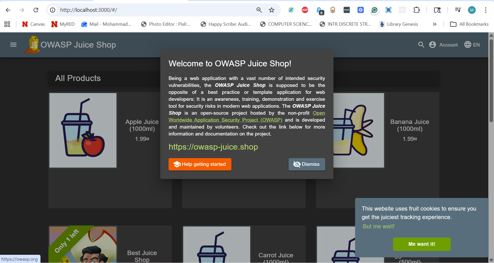
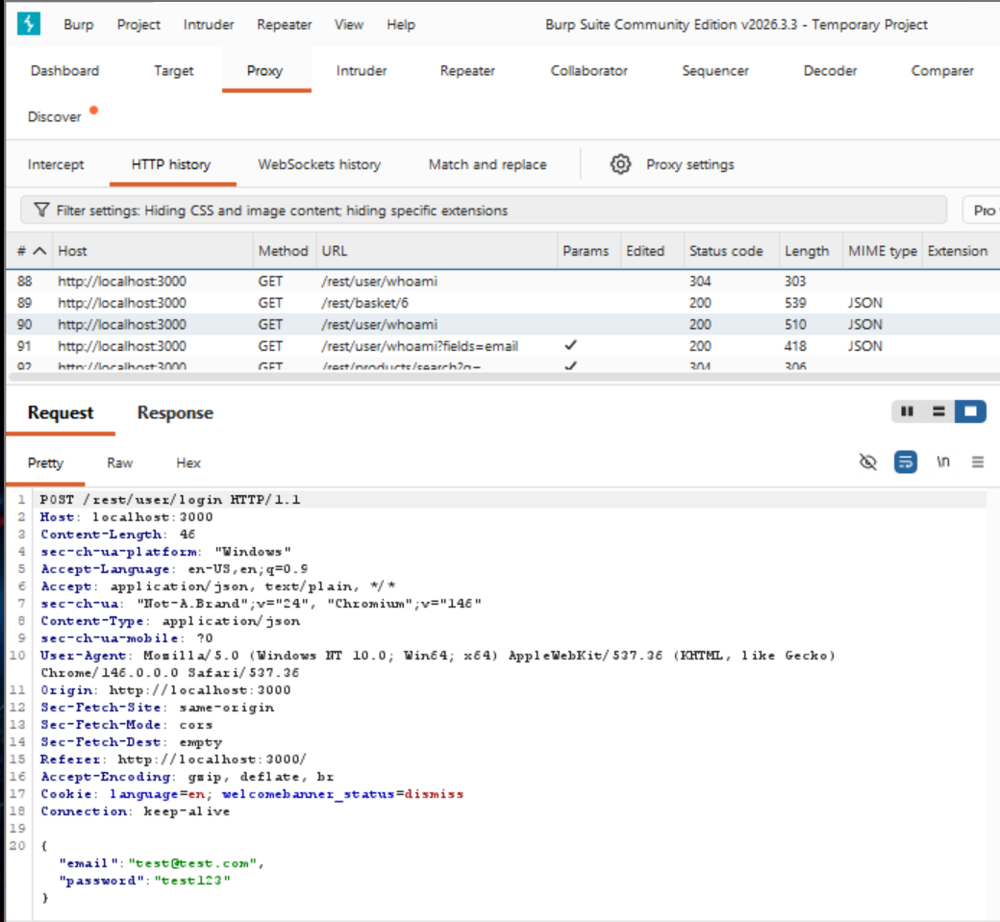
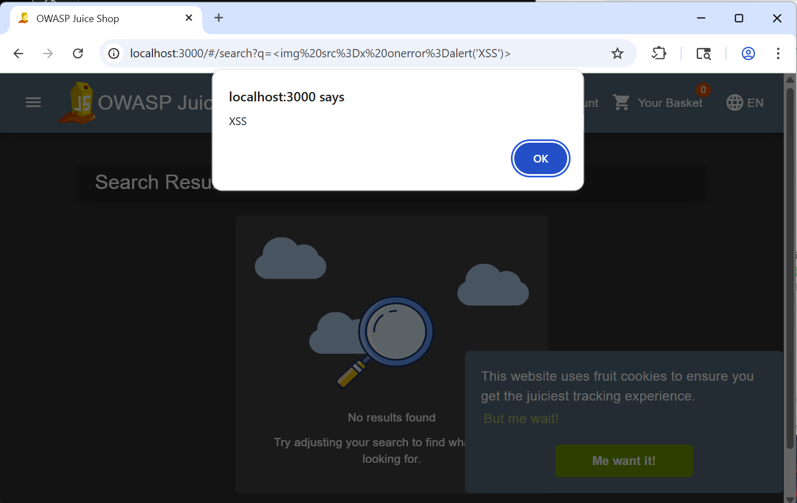
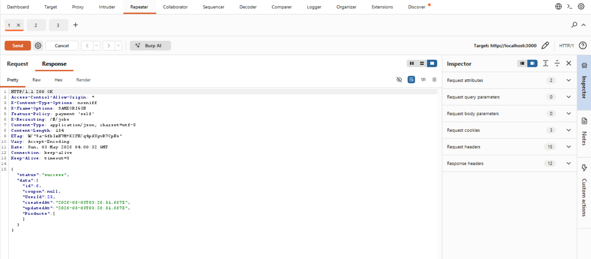
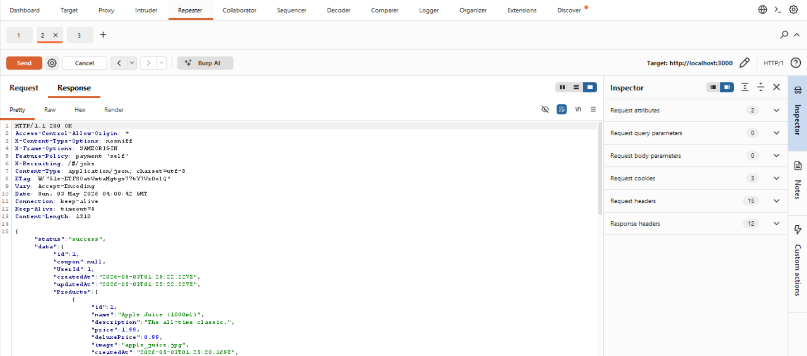
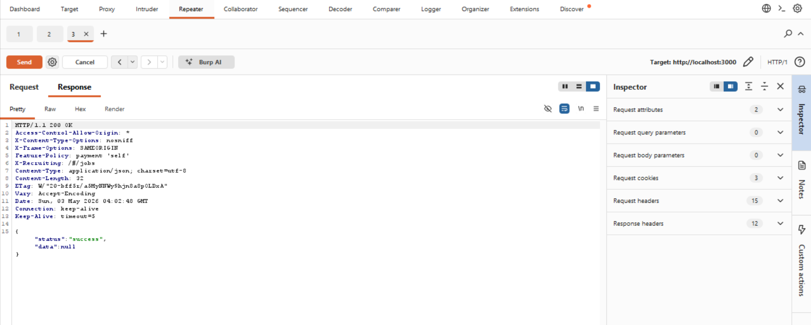
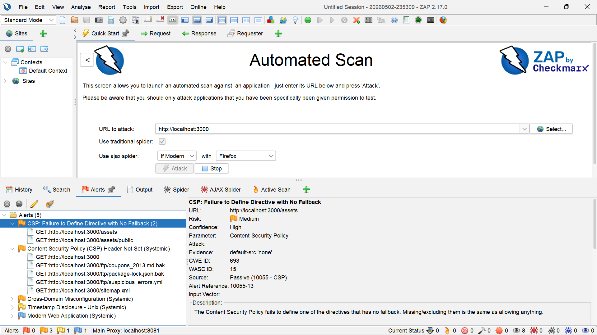

# Web Application Security Assessment Report

## 1. Executive Summary

This report documents a structured security assessment of OWASP Juice Shop, a locally hosted intentionally vulnerable web application. The assessment demonstrates application security testing methodology, including manual testing, request interception, dynamic scanning, vulnerability documentation, and remediation planning.

The assessment identified multiple common web application risks aligned with the OWASP Top 10, including injection, cross-site scripting, broken access control, and sensitive data exposure.

---

## 2. Assessment Scope

**Target:** OWASP Juice Shop
**URL:** `http://localhost:3000`
**Environment:** Local Docker container
**Testing Type:** Authorized local security assessment

### Target Application



*Figure: OWASP Juice Shop running locally via Docker.*

---

### In Scope

* Authentication and login behavior
* Search and user input fields
* API requests and responses
* Client-side storage
* Access control behavior
* Automated DAST scan results
* Manual vulnerability validation

### Out of Scope

* Third-party websites
* External networks
* Production systems
* Denial-of-service testing
* Social engineering

---

## 3. Tools Used

| Tool                    | Purpose                                       |
| ----------------------- | --------------------------------------------- |
| Docker                  | Local deployment of target application        |
| Burp Suite              | Manual request interception and HTTP analysis |
| OWASP ZAP               | Automated DAST-style scanning                 |
| Browser Developer Tools | Client-side storage analysis                  |
| OWASP Top 10            | Vulnerability classification                  |

---

## 4. Methodology

The assessment followed a structured workflow:

1. Deploy the target application locally
2. Map core functionality
3. Capture HTTP traffic using Burp Suite
4. Run automated scanning using OWASP ZAP
5. Perform manual vulnerability testing
6. Classify findings by severity and OWASP category
7. Document evidence and business impact
8. Assess exploitability and risk
9. Recommend remediation strategies

### Proxy Interception



*Figure: Burp Suite intercepting HTTP requests for analysis.*

---

## 5. Findings

---

## Finding 1: SQL Injection

**Severity:** High
**OWASP Category:** Injection
**Status:** Tested

### Description

The authentication endpoint (`POST /rest/user/login`) was intercepted using Burp Suite, exposing user-controlled input fields (`email`, `password`). These fields were manually modified to test for injection vulnerabilities.

### Evidence

Payload tested:

```sql
' OR 1=1--
```

### Screenshot Evidence


*Figure: Modified login request demonstrating injection attempt.*

### Impact

Potential authentication bypass, unauthorized access, and database manipulation depending on backend query handling.

### Remediation

* Use parameterized queries
* Validate and sanitize input
* Apply least-privilege database access

---

## Finding 2: Cross-Site Scripting (XSS)

**Severity:** Medium
**OWASP Category:** Injection / XSS
**Status:** Confirmed

### Description

User input in the search functionality is reflected without sanitization, allowing execution of injected JavaScript.

### Evidence

```html

```

### Screenshot Evidence



*Figure: Reflected XSS payload executed in browser.*

### Impact

Possible session hijacking, credential theft, and client-side attacks.

### Remediation

* Encode output
* Sanitize input
* Implement CSP

---

## Finding 3: Broken Access Control (IDOR)

**Severity:** High  
**OWASP Category:** Broken Access Control  
**Status:** Confirmed  

### Description

The application exposes direct object references through API endpoints without enforcing proper authorization checks. By modifying resource identifiers, it is possible to access data belonging to other users.

### Evidence

Tested endpoint:

GET /rest/basket/{id}

Modified requests:
- `/rest/basket/6` → returned user basket data  
- `/rest/basket/1` → returned different basket data  
- `/rest/basket/999` → returned null  

This demonstrates that the application does not validate resource ownership before returning data.

### Screenshot Evidence

**Original Request (Authorized Resource)**  


**Modified Request (Accessing Different Resource)**  


**Invalid Resource Identifier**  


*Figure: API responses change based on modified resource identifiers, demonstrating lack of authorization enforcement.*

### Impact

An attacker could enumerate and access other users' data by modifying object identifiers, leading to unauthorized data exposure and potential privilege escalation.

### Remediation

- Enforce server-side authorization checks on all resource access  
- Validate object ownership before returning data  
- Implement role-based access control (RBAC)  
- Avoid exposing predictable object identifiers

## Finding 4: Sensitive Data Exposure

**Severity:** Medium  
**OWASP Category:** Security Misconfiguration / Cryptographic Failures  
**Status:** Reviewed  

### Description

Client-side storage and application responses were reviewed to identify potential exposure of sensitive information.

### Evidence

Inspection performed using browser developer tools, reviewing:

- Local storage  
- Session storage  
- Cookies  
- JWT token and Session ID observed in Local Storage and Cookies

### Screenshot Evidence


*Figure: Client-side storage accessible via browser developer tools.*

### Impact

If sensitive data (e.g., authentication tokens or user data) is stored insecurely on the client, it may be accessible to attackers through browser inspection or cross-site scripting attacks.

### Remediation

- Avoid storing sensitive data in local storage  
- Use secure cookie attributes (HttpOnly, Secure, SameSite)  
- Minimize sensitive data exposure in responses  
- Apply encryption where appropriate

## 6. Automated DAST Scan Summary

### Screenshot Evidence



*Figure: OWASP ZAP scan results.*

### Summary

Automated scanning supported manual findings and identified additional low-to-medium severity issues for further investigation.

---

## 7. AI/LLM Security Considerations

| Risk             | Description                              | Control             |
| ---------------- | ---------------------------------------- | ------------------- |
| Prompt Injection | Manipulated input affects model behavior | Input filtering     |
| Output Handling  | Unsafe outputs trusted                   | Output validation   |
| Data Leakage     | Unauthorized data retrieval              | Access restrictions |

---

## 8. Risk Summary

| Finding        | Severity | Impact                |
| -------------- | -------: | --------------------- |
| SQL Injection  |     High | Unauthorized access   |
| XSS            |   Medium | Client-side execution |
| Access Control |     High | Data exposure         |
| Sensitive Data |   Medium | Info leakage          |

---

## 9. Recommendations

* Follow OWASP secure coding practices
* Integrate security into CI/CD
* Perform regular testing
* Apply least-privilege access

---

## 10. Conclusion

This assessment demonstrates practical application security skills, including request interception, vulnerability testing, and risk-based analysis aligned with secure SDLC practices.
